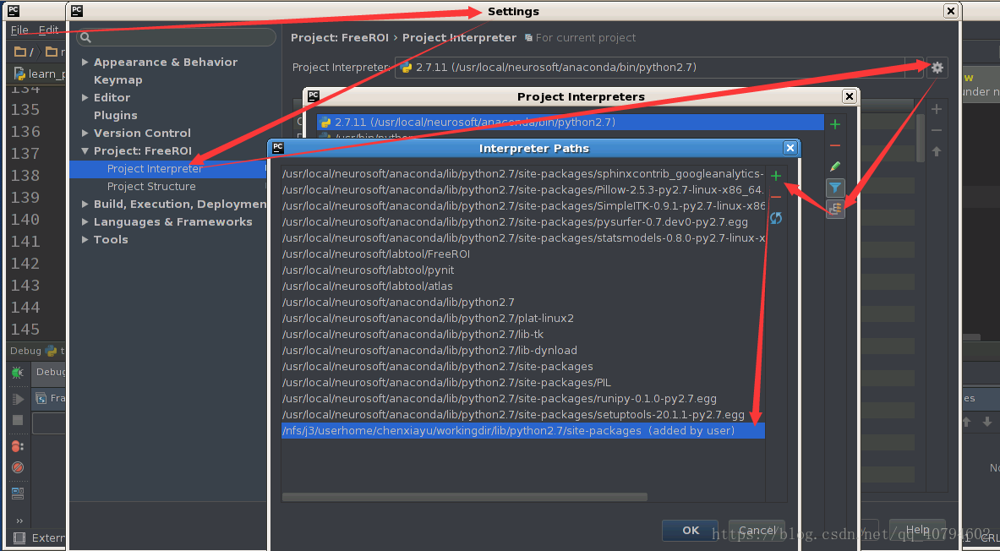
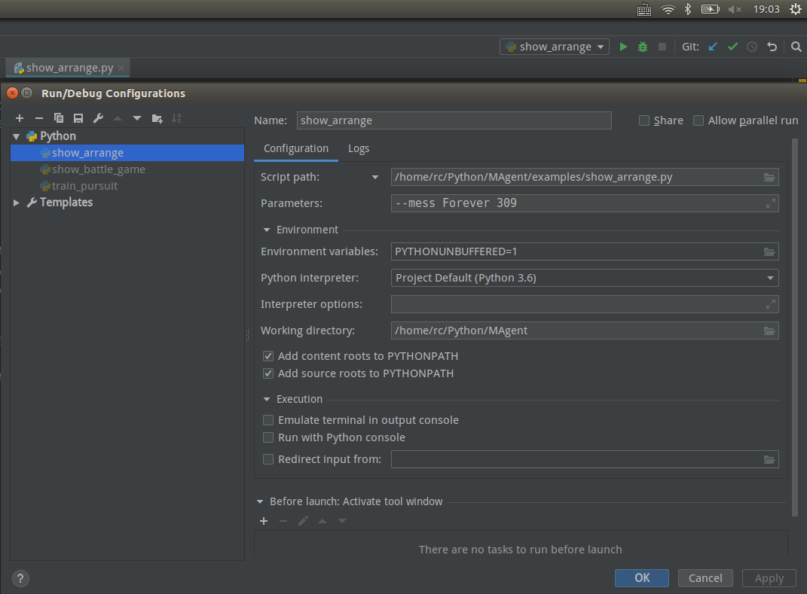

<h1></h1>
MAgent is a research platform for many-agent reinforcement learning.
Unlike previous research platforms that focus on reinforcement learning research with a single agent or only few agents, 
MAgent aims at supporting reinforcement learning research that scales up from hundreds to millions of agents.

- AAAI 2018 demo paper: [MAgent: A Many-Agent Reinforcement Learning Platform for Artificial Collective Intelligence](https://arxiv.org/abs/1712.00600)
- Watch [our demo video](https://www.youtube.com/watch?v=HCSm0kVolqI) for some interesting show cases.
- Here are two immediate demo for the battle case.


## Requirement
MAgent supports Linux and OS X running Python 2.7 or python 3.
We make no assumptions about the structure of your agents.
You can write rule-based algorithms or use deep learning frameworks.

## Install on Linux

```bash
git clone git@github.com:geek-ai/MAgent.git
cd MAgent

sudo apt-get install cmake libboost-system-dev libjsoncpp-dev libwebsocketpp-dev

bash build.sh
export PYTHONPATH=$(pwd)/python:$PYTHONPATH

conda install matplotlib
sudo pip install pygame
sudo pip install tensorflow==1.5.0
需要cuda


# 如果想使用yum
```

PS:

将MAgent/python路径加入Python搜索路径



Work directory 记得设为MAgent




## Install on OSX

**Note: There is an issue with homebrew for installing websocketpp, please refer to [#17](https://github.com/geek-ai/MAgent/issues/17)**
```bash
git clone git@github.com:geek-ai/MAgent.git
cd MAgent

brew install cmake llvm boost
brew install jsoncpp argp-standalone
brew tap david-icracked/homebrew-websocketpp
brew install --HEAD david-icracked/websocketpp/websocketpp

bash build.sh
export PYTHONPATH=$(pwd)/python:$PYTHONPATH
```

## Docs
[Get started](/doc/get_started.md)


## Examples
The training time of following tasks is about 1 day on a GTX1080-Ti card.
If out-of-memory errors occur, you can tune infer_batch_size smaller in models.

**Note** : You should run following examples in the root directory of this repo. Do not cd to `examples/`.

### Train
Three examples shown in the above video.
Video files will be saved every 10 rounds. You can use render to watch them.

* **pursuit**

  ```
  python examples/train_pursuit.py --train
  ```

* **gathering**

  ```
  python examples/train_gather.py --train
  ```

* **battle**

  ```
  python examples/train_battle.py --train
  ```
### Play
An interactive game to play with battle agents. You will act as a general and dispatch your soldiers.

* **battle game**

    ```
    python examples/show_battle_game.py
    ```

## Baseline Algorithms
The baseline algorithms parameter-sharing DQN, DRQN, a2c are implemented in Tensorflow and MXNet.
DQN performs best in our large number sharing and gridworld settings.

## Acknowledgement
Many thanks to [Tianqi Chen](https://tqchen.github.io/) for the helpful suggestions.


## 重点记录

### get_started 主要包括如何设置：

1. environment
2. Agent 参数 大小、可以捕猎的物种
3. observation 可以或得到环境的那些信息
4. Agent's action 反馈生成方法
5. Reward 对于某一action的reward
6. 计算时的并行性

### [Tutorial for Many Kinds of Agents.md ](/home/rc/Python/MAgent/doc/Tutorial for Many Kinds of Agents.md)主要包括如何设置上述参数并修改代码

1. agent的 参数 大小 位置 构建符号 reward rules 参考 [Pursuit.py](python/magent/builtin/config/pursuit.py)
2. 训练代码的书写 参考**train_pursuit.py**

### examples/README.md

**examples里面的的文件**主要是一些例子 api_demo.py

我们重点要做的修改是train_single.py

可以看看show_arragen.py 里面涉及让agent将自己安排到特定的角色

### 几个比较重要的文件的路径：


这个在更深地探究的时候可以用到

python/magent/model.py 包含了所有模型的基本信息

python/magent/gridworld 定义了基本的世界

python/magent/model 定义了需要的模型

builtin 基于的RL和configs

scripts里面放置了一堆绘图函数+test(一堆测试文件，应该也是可以运行的)


## 进度记录

### 11.21

1. pursuit.py
2. train_pursuit.py
3. api.demo.py

1. show_arragen.py
2. train_single.py 其实所有的train的代码都类似
   1. 生成地图 地图的形状 （在下面设置Reward函数）
   2. 初始化agent agent的位置，类型
   3. 进行单轮的训练
      1. 获得agent对于环境的观察
      2. 获得agent的标号
      3. 获得agent对当前环境的反应
      4. 将所有agent的action作用于环境上
      5. 计算每个agent的Reward，被记录一路上i获得的reward
      6. （清理死亡的agent，进行渲染）
      7. 对每个模型进行训练

train_single.py

```
"""
这里的话，我认为是应该先根据t-1时刻的环境，让t时刻的所有智能体做出选择然后统一更新环境。
源代码中写成了t-1时的前面的agent已经改变了环境，然后再计算t-1时刻其他的agent，这样不符合根据t-1时刻环境决定t时刻action的前提（其实算是一种作弊行为吧）
for i in range(n):
    acts[i] = models[i].fetch_action()  # fetch actions (blocking)  # 将每个智能体的行为添加到环境中
    env.set_action(handles[i], acts[i])

"""
```

### 11.22

看懂show的代码，如何进行渲染的

尝试更改agent训练的代码

1. agent
   1. attack 方式
   2. 受伤方式 可能会以reward的形式体现：Reward方式里可能会包括 自己的受损、造成伤害。emmm，KDA？
   3. 对于环境观察的方式
2. 环境：
   1. Reward rules
   2. 生成地图

### 11.23

配置服务器环境

#### 无法直接使用此命令配置环境

```
sudo apt-get install cmake libboost-system-dev libjsoncpp-dev libwebsocketpp-dev
```

服务器版本如下

```bash
(base) [lqz@gpu02 ~]$ lsb_release -a
LSB Version:	:core-4.1-amd64:core-4.1-noarch:cxx-4.1-amd64:cxx-4.1-noarch:desktop-4.1-amd64:desktop-4.1-noarch:languages-4.1-amd64:languages-4.1-noarch:printing-4.1-amd64:printing-4.1-noarch
Distributor ID:	CentOS
Description:	CentOS Linux release 7.3.1611 (Core) 
Release:	7.3.1611
Codename:	Core
```

centos不能直接使用apt-get，因为CentOS不能安装apt x 

一个包一个包安装，解压包安装cmake 版本总没法更新到cmake3

```shell
$ conda install cmake 
$ sudo yum install boost-devel
$ sudo yum install jsoncpp-devel # https://blog.csdn.net/techkuki/article/details/48130513

# installing WebSocket++  https://airdcpp-web.github.io/docs/installation/websocketpp.html
$ git clone 	 git://github.com/zaphoyd/websocketpp.git
$ cd websocketpp
$ cmake .
$ sudo make install
$ cd ..
<<<<<<< HEAD
=======
# but 这样 bash build.sh 跳的错误，反而 更多了...掀桌.jpg
>>>>>>> 8481ccbbd7eead13cd6b07156c64cde4cbc81bca
```

突然想到，我直接将编译好的文件传过去不就好了吗…

but build 出来的文件 好像不能被git add 添加上，压缩，然后传过去吧。

[压缩](https://blog.csdn.net/songbinxu/article/details/80435665
)

[scp实现linux文件传输](https://blog.csdn.net/crazy_zh/article/details/89925339) 

### 11.24

看完代码中不懂的地方  # TODO

[train_single_note.md](doc/train_single_note.md)

有空时间再整环境


### 12.06

前几天读论文去了

前天看了一部分论文，但是在本机ubuntu上运行了Chrome 的安装程序，系统就循环启动了，这次确实没有用apt-get update。总不能一直不用apt-get update，什么软件也不敢安装，一直一套torch0.4.1走天下。于是重装系统，探索更加适合的驱动、cuda、cuDNN。用了昨天一下午的时间。

贴个运行结果

```shell
Device mapping:
/job:localhost/replica:0/task:0/device:GPU:0 -> device: 0, name: GeForce 940MX, pci bus id: 0000:01:00.0, compute capability: 5.0
2019-12-07 14:56:45.492140: I tensorflow/core/common_runtime/direct_session.cc:288] Device mapping:
/job:localhost/replica:0/task:0/device:GPU:0 -> device: 0, name: GeForce 940MX, pci bus id: 0000:01:00.0, compute capability: 5.0
```

也多参考下别人的成果

1. 原论文
2. 其他人如何使用MAgent
3. 看看自己的TODO

然后写代码
